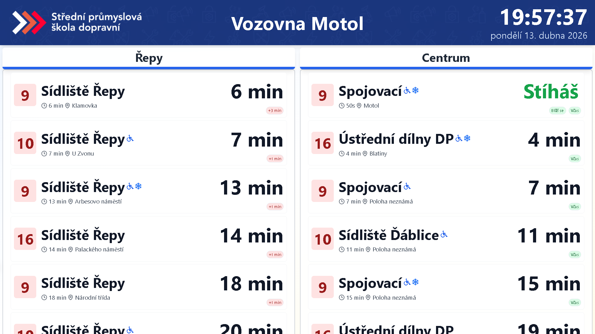
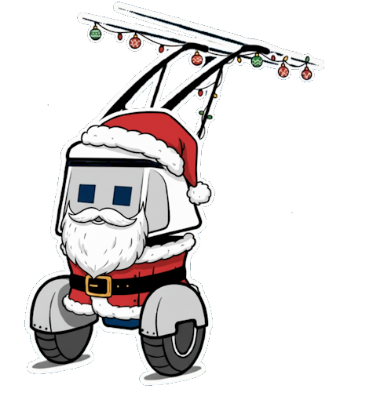
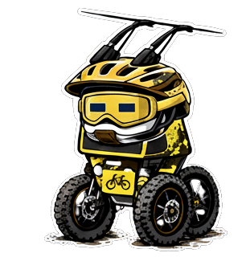

# SPŠD Odjezdová tabule

<p align="center">
  
</p>

<p align="center">
  <strong>Verze 3.0</strong> · Desktop tabule + plnohodnotná mobilní webová aplikace
</p>

<p align="center">
  
  
  
  
  
  
</p>

---

## Co to je

**SPŠD Odjezdová tabule** je real-time informační systém pro studenty Střední průmyslové školy dopravní v Praze. Zobrazuje aktuální odjezdy MHD z okolí školních budov — tramvaje, autobusy, metro i vlaky — a řeší tak každodenní problém "kdy mi to jede a jestli to stihnu".

Projekt běží **24/7** ve dvou režimech:

1. 🖥️ **Desktop / TV tabule** — fullscreen displej u vchodu školy (původní účel projektu, 55" TV)
2. 📱 **Mobilní web app** — kompletní PWA s live trackingem spojů, notifikacemi, mapou a personalizací (nová verze 3.0)

<p align="center">
  
</p>

**Škola:** Střední průmyslová škola dopravní, Praha
**Budovy:** Motol · Moravská · Bikefest (akce)

---

## ✨ Co přináší verze 3.0

### 🎉 Mobilní web app — READY

Kompletně nová mobilní verze dostupná na `/m`. Postavená jako PWA — přidáš si ji na plochu a chová se jako nativní aplikace.

**Co umí:**

- 📍 **Live GPS walk-time** — vypočítá v reálném čase, kolik minut ti zabere dojít na zastávku podle tvé aktuální polohy. Kliknutím se otevře Apple Maps / Google Maps s pěší navigací
- 🔔 **Push notifikace** přes Firebase Cloud Messaging (FCM v1) — upozornění typu "spoj za 5 min" nebo "spoj projíždí zastávkou X". Funguje i když je appka zavřená
- 🚋 **Detailní tracker spoje** — otevřeš odjezd a vidíš celou trasu s animovanou pozicí vozidla, zpoždění, příslušenství (klima, bezbariérovost, USB, WiFi, držáky kol), pokračování linky bez přestupu a historická data o zpožděních
- 🗺️ **Mapa vozidel** — live pozice všech vozidel linek, které jedou ke škole (Leaflet + Golemio vehicle positions API)
- ⚙️ **Nastavení** — světlý / tmavý / automatický režim, perzistentní přes `localStorage`, bez záblesku při startu
- 🔗 **Sdílení spoje** — URL `?openTrip=…`, příjemce vidí přesně ten samý spoj s trackerem
- ⤵️ **Pull-to-refresh** na seznamu odjezdů
- ↔️ **Swipe** mezi zastávkami (Nástupiště A ↔ B ↔ vlakové nádraží atd.)
- 📶 **Offline-first UI** — při výpadku API se drží poslední platná data s upozorněním
- 🍎 **iOS PWA support** — banner, který iPhone uživatele nauče appku přidat na plochu

**Mobilní routy:**

| Cesta | Popis |
|-------|-------|
| `/m` | Výběr budovy (Motol / Moravská / Bikefest) |
| `/m/motol` | Odjezdy u budovy Motol (Vozovna Motol, metro Motol) |
| `/m/moravska` | Odjezdy u budovy Moravská (Jana Masaryka, Šumavská) |
| `/m/bikefest` | Odjezdy během akce Bikefest (Výstaviště, Praha-Bubny) |
| `/m/map` | Live mapa vozidel |
| `/m/profile` | Nastavení |
| `/share?d=…` | Otevření sdíleného spoje |

### 🖥️ Desktop / TV tabule

Původní desktop verze — běží fullscreen na 55" TV u vchodu školy:

- Real-time odjezdy s automatickou rotací zastávek každých 15 s
- Počasí (teplota, vlhkost, vítr, UV) z WeatherAPI.com
- Návěstidla u vlakových zastávek
- Info o výlukách, zkrácených jízdách, pokračování linek
- Ikony příslušenství vozidel
- Záložní data při výpadku API (fallback s upozorněním)
- Vysoký kontrast a velké písmo navržené pro čitelnost z dálky

Routy: `/spsmotol` · `/spsmoravska` · `/bikefest` · `/menu` (výběr)

### 🎭 Sezónní maskot

8 variant robota, který se automaticky přepíná podle ročního období:

<p align="center">
  
  
  
  
</p>
<p align="center">
  
  
  
  
</p>

Jaro · Léto · Podzim · Zima · Vánoce · Halloween · Velikonoce · Bikefest

---

## 🛠️ Technologie

| Oblast | Stack |
|--------|-------|
| **Frontend** | React 18 · TypeScript 5 · Vite 5 · Tailwind CSS 3 |
| **UI** | Framer Motion · Lucide Icons · Font Awesome · shadcn/ui primitivy |
| **Routing** | React Router v6 (lazy-loaded routy) |
| **Mapa** | Leaflet + React-Leaflet |
| **Data MHD** | [PID Golemio API v2](https://api.golemio.cz) (departure boards, vehicle positions, trip stops) |
| **Počasí** | WeatherAPI.com |
| **Backend** | Supabase (PostgreSQL + Edge Functions) |
| **Push** | Firebase Cloud Messaging (FCM v1 API) |
| **PWA** | `vite-plugin-pwa` + Workbox |
| **Hosting** | Vercel |

---

## 🚀 Spuštění lokálně

```bash
# 1. Naklonuj repo
git clone <url-repozitare>
cd spsd_timetable

# 2. Instalace
npm install

# 3. Vytvoř .env.local (viz sekce níže)

# 4. Dev server
npm run dev:watch        # vite dev server (hot reload)
# nebo
npm run build            # produkční build → dist/
npm run preview          # preview produkčního buildu
```

Aplikace poběží na `http://localhost:5173`.

### ENV proměnné

Vytvoř `.env.local` v rootu:

| Proměnná | Popis | Povinná |
|----------|-------|---------|
| `VITE_SUPABASE_URL` | URL Supabase projektu | Ano |
| `VITE_SUPABASE_ANON_KEY` | Anon (public) klíč Supabase | Ano |
| `VITE_WEATHER_API_KEY` | API klíč pro WeatherAPI.com | Ne |

Golemio API token je zahardcodován v kódu (veřejný read-only). Firebase config je v `index.html`.

### Supabase

Schéma databáze je v `supabase-schema.sql` — spusť v Supabase SQL Editoru.
Edge Function pro cron push notifikací je v `supabase/functions/check-notifications/`.

---

## 📁 Struktura projektu

```
src/
├── pages/                      # Routy
│   ├── Index.tsx               # Landing page
│   ├── Menu.tsx                # Desktop menu (výběr budovy)
│   ├── Spsmotol.tsx            # 🖥️  Desktop tabule Motol
│   ├── SpsMoravska.tsx         # 🖥️  Desktop tabule Moravská
│   ├── Bikefest.tsx            # 🖥️  Desktop tabule Bikefest
│   ├── Mobile.tsx              # 📱 /m — výběr budovy
│   ├── MobileMotol.tsx         # 📱 /m/motol
│   ├── MobileMoravska.tsx      # 📱 /m/moravska
│   ├── MobileBikefest.tsx      # 📱 /m/bikefest
│   ├── MobileMap.tsx           # 📱 /m/map — live mapa
│   ├── MobileProfile.tsx       # 📱 /m/profile — nastavení
│   └── Share.tsx               # /share — příjem sdíleného spoje
│
├── components/
│   ├── MobileDepartures.tsx    # Reusable mobilní odjezdy (cards, tabs, swipe, PTR)
│   ├── DepartureTracker.tsx    # Sheet s live trackingem spoje
│   ├── BottomNav.tsx           # Spodní lišta (Odjezdy / Mapa / Nastavení)
│   ├── PwaInstallPrompt.tsx    # Banner pro iOS "Přidat na plochu"
│   └── TramDeparturesConnected.tsx  # Desktop odjezdy
│
├── utils/
│   ├── pidApi.ts               # Wrapper nad Golemio API
│   ├── firebase.ts             # FCM setup
│   ├── notificationService.ts  # Supabase notifikace CRUD
│   ├── delayHistory.ts         # Ukládání / čtení zpoždění
│   ├── walking.ts              # Walk-time kalkulace (Haversine + průměrné tempo)
│   ├── useUserLocation.ts      # Geolokace hook
│   ├── usePullToRefresh.ts     # PTR hook
│   ├── useDarkMode.ts          # Dark mode s localStorage + anti-flash
│   └── supabase.ts
│
└── context/
    ├── DataContext.tsx         # Globální store pro odjezdy + čas
    └── ThemeContext.tsx        # Sezónní téma (robot, logo)

supabase/
└── functions/
    └── check-notifications/    # Edge Function pro cron push notifikace
```

---

## 🌐 Deployment (Vercel)

1. Pushni kód na GitHub
2. Přihlas se na [vercel.com](https://vercel.com) → **Add New Project**
3. Framework preset: **Vite**
4. Přidej ENV proměnné v **Settings → Environment Variables**
5. Deploy

Vlastní doména se přidává v **Settings → Domains**. Nezapomeň ji přidat i do Supabase **Authentication → URL Configuration**.

---

## 🐛 Známá chování

- **iOS Safari / PWA home indicator** — tmavý pás v dolní části obrazovky na iPhone je iOS systémová oblast (home indicator safe area). V Safari browseru je defaultně černá, v PWA módu respektuje `theme-color` meta. Po změně `theme-color` je nutné appku odebrat a znovu přidat na plochu, aby se meta tagy obnovily.
- **FCM push na iOS** — funguje pouze pokud je appka nainstalovaná jako PWA (Safari → Sdílet → Přidat na plochu). V běžném Safari browseru iOS push API není dostupné.

---

## 👤 Autor

**Adam "Brozovec" Brož** — SPŠD Praha

---

## 📜 Licence

Interní projekt Střední průmyslové školy dopravní v Praze. Není určeno pro veřejné použití bez souhlasu školy.
